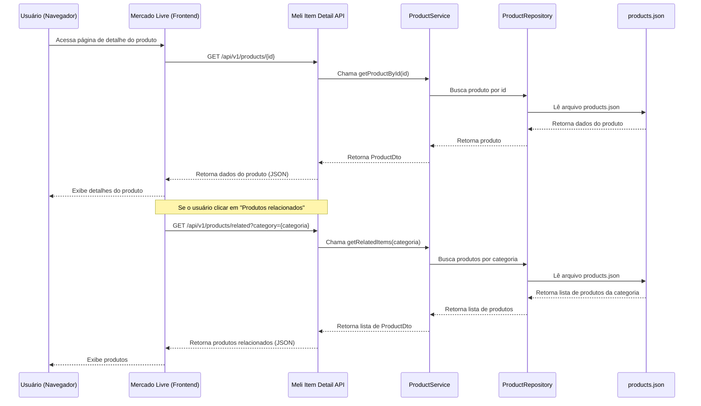

# Meli Item Detail API

[🔗 Projeto no GitHub](https://github.com/DiogoEller/meli-item-detail-api/tree/main)

## Visão Geral

API RESTful para gerenciamento de produtos, incluindo busca por produtos relacionados via categoria. Persistência em arquivo JSON. Documentação automática via Swagger.

## Diagrama de fluxo (Mermaid)

Abaixo está um diagrama detalhando o fluxo para a página de detalhe de um produto no site do Mercado Livre, mostrando como ela consome nossa API e o que acontece internamente:

## Endpoints Principais

| Método | Endpoint                        | Descrição                                 |
|--------|---------------------------------|-------------------------------------------|
| GET    | `/api/v1/products`              | Lista todos os produtos                   |
| GET    | `/api/v1/products/{id}`         | Busca produto por ID                      |
| POST   | `/api/v1/products`              | Cria um novo produto                      |
| PUT    | `/api/v1/products/{id}`         | Atualiza um produto                       |
| DELETE | `/api/v1/products/{id}`         | Remove um produto                         |
| GET    | `/api/v1/products/related`      | Lista produtos relacionados por categoria |

## Decisões Técnicas e Estratégias Arquiteturais

- **Stack:** Java 17, Spring Boot 3.x, Lombok, Jackson, SpringDoc OpenAPI, JUnit 5, Mockito
- **Persistência:** O "banco de dados" é um arquivo JSON configurável, facilitando testes, portabilidade e entendimento do fluxo de dados.
- **Arquitetura:** Separação por responsabilidade (MVC, DTO, Mapper, Exception, Interface), seguindo o padrão Model-View-Controller.
- **SOLID:** Princípios SOLID aplicados, com separação clara de responsabilidades, uso de interfaces para desacoplamento e facilidade de testes/mocks.
- **RESTful:** Endpoints seguem convenções REST, utilizando métodos HTTP adequados, URIs semânticas e respostas padronizadas.
- **Tratamento de Exceção:** Handler global (`@ControllerAdvice`) para padronizar respostas de erro e facilitar o diagnóstico de problemas.
- **Testes:** Unitários e integração cobrindo casos de sucesso e erro, utilizando JUnit 5 e Mockito.
- **Documentação:** Swagger/OpenAPI para documentação automática dos endpoints.
- **GenAI & Ferramentas Modernas:** O projeto foi acelerado com uso de ferramentas de IA (GitHub Copilot, ChatGPT, Mermaid) para geração de código, documentação e testes.

## Setup

Veja o arquivo `run.md` para instruções detalhadas de execução.